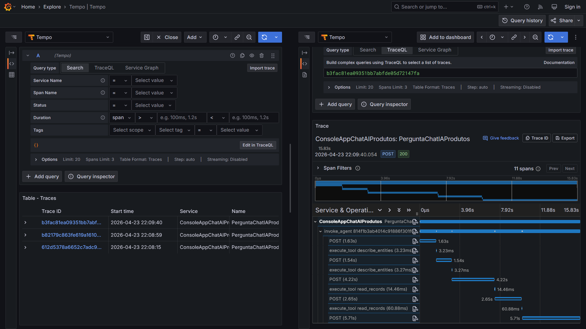

# dotnet10-agent-framework-sqlserver-mcp-otel-grafana_consultaprodutos
Exemplo em .NET 10 de Console Application que faz uso do Microsoft Agent Framework, com integração com o Microsoft Foundry como solução de IA Generativa na consulta de informações de produtos em uma base SQL Server. Inclui o uso do MCP oficial do SQL Server e observabilidade com Grafana + OpenTelemetry (via Docker Compose).

Referências:
* Introducing SQL MCP Server: https://devblogs.microsoft.com/azure-sql/introducing-sql-mcp-server/
* Data API builder documentation: https://learn.microsoft.com/en-us/azure/data-api-builder/

Exemplo de trace gerado pela aplicação de testes:

